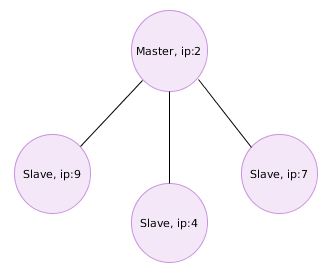
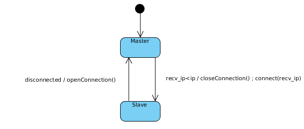
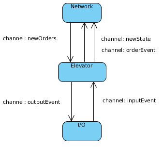
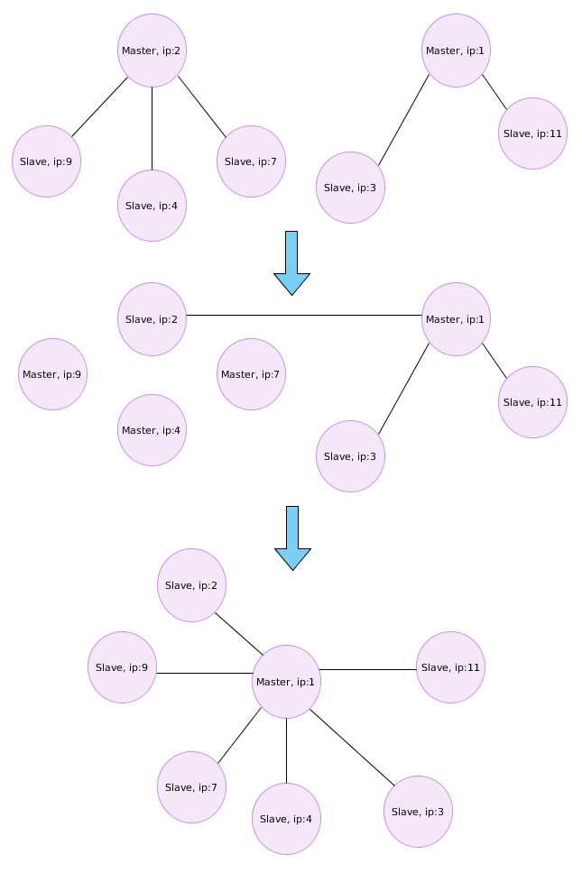

# Presentation

## Networktopology

All elevators are connected to a dynamic master-slave TCP network. Every node in the network (elevator) can be in one of two states: Master or slave. The master is active and handles order synchronization, events and order assignments, for all nodes including itself. The slaves are passive and only forward all events and acts locally on orders assigned from master.

The master is dynamically chosen to be the node on the local network with the lowest ip-address. Because the network may consist of multiple sub-networks (multiple masters), the master is chosen by merging the sub-networks using the following simple algoritm:

A network may consist of multiple sub-network and therefore multiple masters. All nodes are initially masters. The masters listen for TCP connections and repeatedly broadcast their ip-address over UDP. All masters listen for these packages. If a master receives such a package from a sender with ip-address lower than it's own, it closes it's connection to it's slaves and connects to the sender's ip. The node is now a slave until it is disconnected from it's master.

## Modularization

A single elevator is divided into three primary modules: 

* Network
* Elevator
* I/O

As the project is implemented in Go, each module is implemented as a goroutine with channels between them to share data concurrently.

### Network module

The primary function of this module is to communicate with other nodes. An important part of this is to connect to the master or open connection for slaves (through UDP-broadcasting) if the given elevator is the current master. When a node is a master it also calculates a cost-function to decide which elevator gets the orders. The network module knows the state of and orders from the local elevator, communicates with all nodes to distribute the orders. 

* channel: newOrders - When a new order arrives the node, the order is sent into this channel so that the elevator module can read it

### Elevator module

The elevator module keeps track of the given elevator's state, local orders, global orders, and new events. This data is used to control the elevator. By looking at the local orders and the state of the given elevator this modules determines the output of the motor. It also controls the lights by looking at the list of global orders. 

* channel: newState - When the elevator transitions from one state to another, the new state is sent into this channel so that the network module can read it

* channel: orderEvent -  When a new event is detected, the order is sent into this channel so that the network module can read it

* channel: outputEvent - When a new order is detected or the lights of the elevator needs to change, the event is sent into this channel so that the I/O module can read it

### I/O module

The primary function of the I/O module is to keep track of which buttons are pressed, when a floor is reached, when the door is open, and to set the direction and speed of the motor in the elevator. It also sends this data forward to the elevator module. 

* channel: inputEvent - When a new event is detected by the I/O module, the event is sent into this channel so that the elevator module can read it 

## Order preservation

To perserve all orders, all orders in the system are stored in each module in a global and a local queue.

* Global -- All orders in the network. All nodes should have identical global orders. The master handles synchronization of these orders.

* Local -- Orders that the local node is assigned to do by the master

## Error handling

* Flipped bit -- In the network's communication, TCP has checksum to verify no flipped bits, and resends if checksum is not satisfied.

* Power loss / software crash -- If a node, master or slave, for some reason crashes, every other node has a copy of the global orders such that the system can recover. If the disconnected node is a slave, the master will simply detect the disconnection and redistribute all global orders to the remaining nodes (including itself). If the disconnected node is a master, all it's slaves will become masters and at first act on all the orders by their self. Eventually they will merge to a single master (by protocol) and the new master will redistribute the orders.

* Disconnect -- If a node disconnects, the network will handle the situation as if the node is dead (power loss). The single disconnected node will become master and act as if all other nodes are dead. In this situation multiple elevators may process the same orders, but no orders will be lost (not acted on).

* Elevator hangs / never arrives -- If the physical elevator does not reach the next floor before a given timeout, the local program is terminated and must be investigated by an operator before manually restarted. The other nodes will act as if the given elevator is dead, and will redistribute all global orders.

* UDP packet is lost -- This will cause no problem because UDP is only used for broadcasting repeatedly. If one does not arrive, eventually one of the following will.

* Disconnect while order is sending to master -- A buffer in the network module prevents orders from being deleted locally when disconnecting from master. As the node switches to master, it can then handle the order itself. The master clears the buffer when all slaves have received the order. Slaves wait for the master to return the order before clearing the buffer.

## Examples

Example of merging multiple sub-networks.

